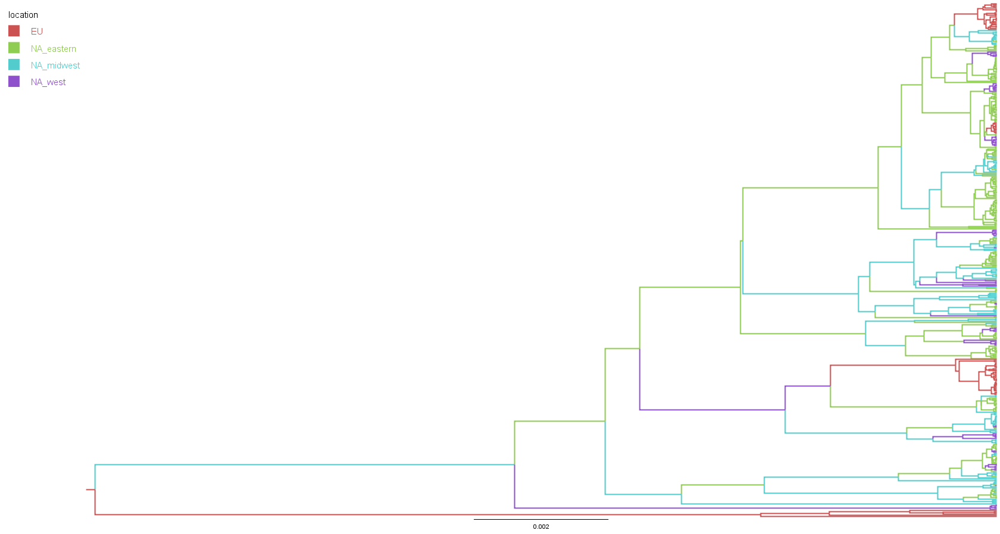

# Using pathogen sequence data to track the spread of _Borrelia Burgdorferi Sensu Stricto_ across regions in North America and Western Europe

# Authors
* John "Frank" Burkhart and Ethan Smith

## Table of Contents
- [Introduction](#introduction)
- [Data Source](#data)
- [Methods and Software](#methods-and-software)
- [Results](#results)
- [Repository Structure](#respository-structure)


## Introduction
Lyme disease is a vector-borne illness that is transmitted by the Spirochete
Borrelia Burgdorferi. The complex migratory patterns of the hosts this pathogen feeds on makes studying the
phylogeography of Borrelia Burgdorferi of great interest.
Given this complex migratory patterns of this pathogen, working towards
understanding its spatial spread can greatly aid in Lyme disease mitigation.
In this project, we reconstruct the phylogeography of Borrelia Burgdorferi
across regions in North America and Western Europe. Specifically, reconstruct the phylogeography of Borrelia Burgdorferi using a discrete
trait model, where our traits are regions in Western
North America, Midwestern North America, Eastern North America, and
Western Europe. Our findings show that there exists bi-directional gene flow between the Midwestern and Eastern United States,
Canada, and Europe.


## Data
We gathered our sequence by downloading all available MLST sequences of the standard
housekeeping genes for Borrelia Burgdorferi from [PubMLST](https://pubmlst.org/). These sequences include the
clpA, clpX, nifS, pepX, pyrG, recG, rplB, and uvrA genes. Once these genes are concatenated, each sequence we use is roughly $5000$ bp long.

The sequences we chose to extract came from regions described in the following table. Because of the computational intestity of estimating migration rates using a discrete trait model, we chose to group the original locations into our locations of interest. We analyzed a few different groupings in this study, but the main location grouping we chose to analyze is described in the following table,

| Pooled Group | Original Groups                                                      | Sequence Count |
|--------------|-----------------------------------------------------------------------|----------------|
| **EU**       | UK, Mainland Europe                                                  | 72             |
| **NA East**  | New England, North-East US, QC/NF, NB/PEI/NS, Ontario                | 214            |
| **NA Midwest**| East Mid-West US, West Mid-West US, Manitoba                        | 102            |
| **NA West**  | West US, BC/AB                                                       | 68             |

*Table of the distribution of sequence counts for each discrete trait location of the second grouping.*


## Methods and Software
* After downloading all availabe sequences and corresponding metadata for our regions of interest and cleaning up the FASTA ids with some Python scripts (see project directory structure to locate these), we begin by aligning the sequences using [MAFFT](https://mafft.cbrc.jp/alignment/software/). To speed things along, we performed this step on our school's computing cluster.
* We used [BEAST2](https://www.beast2.org/) to implement the discrete trait model.
* Finally, we imported the MCMC tree file outtputed from our BEAST2 run into [FigTree](http://tree.bio.ed.ac.uk/software/figtree/) to see the results.


## Results 

From our workflow outlined above, we produced our main resulting tree below,



Based on this tree, we can conclude a few results from this analysis:
1. Due to the complex migratory patterns of _Borrelia Burgdorferi Sensu Strictro_ host populations, there is indeed bi-directional gene transfer occuring between each of the regions described in the above table. 
2. There exists at least four separate introduction events of _Borrelia Burgdorferi Sensu Strictro_ into Western Europe from North America, as can be seen by the four European clades are observed from this tree.
3. Despite this pathogen causing Lyme disease, the our analysis confirms that __the pathogen has European origins__.


## File Structure and Repository Information
If you would like to reproduce the results from our analysis, this section is dedicated to you. Here is the file tree with each directory described with the important files highlighted.

```
├── archive
│   ├── first_tree.png                        <- Tree from finer grouping.
│   └── old-data                              <- There is stuff in here that can be safely ignored. It pertains to other analyses.
├── figures
│   ├── batch_2_new_groups_10M.trees.png      <- Main figure highlighted above
│   └── Lyme-cases-by-year.png
├── group_1_data                              <- Different groupings for discrete trait model. Can be ignored for reproducing our analysis.
├── group_2_data                              <- Data for analysis described here.
│   ├── continents_beasted.xml                <- Output of beast run.
│   ├── downsampled_2.fasta                   <- Unaligned sequences.
│   ├── downsampled_metadata_2_revised.txt    <- Sequence metadata.
│   ├── downsampled_sequences_2.aligned.fasta  <- Aligned sequences.
│   └── location_tree_with_trait.trees        <- Tree output.
├── molecular-epi-project-slides.pdf          <- Beamer slides for presentation.
├── molecular-epi-project-write-up.pdf        <- Write-up. Please read for writing sample and to get a better idea of the project.
└── scripts                                   <- Scripts for data manipulation.
    ├── change_fasta_ids.ipynb
    ├── lyme-cases-script.r
    └── sequence_distribution_locations.ipynb
```
